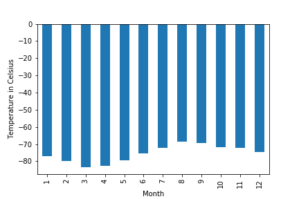
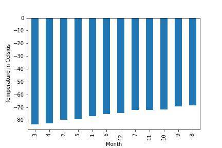
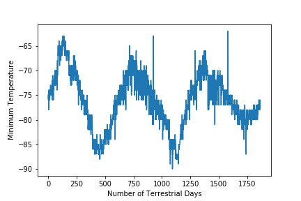

# scrape_challenge

## Part 1- Mars News 

In order to scrape the data from the Mars news site, I first installed webdriver (from selenium), beautiful soup, and chromedriver_autoinstaller in order to set up an instance of Chromedriver that would allow an automated web session at this url address "'https://static.bc-edx.com/data/web/mars_news/index.html'".

Next, I visited the website, set up a beautiful soup object, and extracted all of the text elements for the different articles on the page. Lastly, I stored the title, preview, and date for each article in separate dictionaries, which I then appended to a list. A snippet of my results in provided below:

 {'Title': "NASA's MAVEN Observes Martian Light Show Caused by Major Solar Storm",
  'Preview': 'For the first time in its eight years orbiting Mars, NASA’s MAVEN mission witnessed two different types of ultraviolet aurorae simultaneously, the result of solar storms that began on Aug. 27.',
  'Date': 'November 9, 2022'},
 {'Title': "NASA Prepares to Say 'Farewell' to InSight Spacecraft",
  'Preview': 'A closer look at what goes into wrapping up the mission as the spacecraft’s power supply continues to dwindle.',
  'Date': 'November 1, 2022'},
 {'Title': 'NASA and ESA Agree on Next Steps to Return Mars Samples to Earth',
  'Preview': 'The agency’s Perseverance rover will establish the first sample depot on Mars.',
  'Date': 'October 28, 2022'},

  ## Part 2- Mars Weather

  For this part of the project, I followed a similar procedure to extract the table data from the Mars Temperature Data Site (https://static.bc-edx.com/data/web/mars_facts/temperature.html).

  Next, I transformed the data into a Pandas DataFrame. Pulling out the header values first, running through the rows of data, and then then reinserting the header data as my column headings.

  Lastly, I prepared the data by changing the datatypes where necessary.

  ### Mars Weather Data Analysis

  When analyzing the table data, I answered a series of query questions and represented the results in a series of graphs. These queries and the resulting graphs are listed below.

  ### Avg. Low Temperature on Mars by Month

  

  ### Coldest and Hottest Months (based off Curiosity's Location)

  

  ### Avg. Atmospheric Pressure on Mars by Month (sorted)

  ")

  ### Number of Terrestrial Days in a Martian Year

  

  This graph uses the minimum temperature data to show how the temperature cycles throughout a Martian year. Knowing this, we can see how each cycle takes approximately 675 Earth days to move from one peak to the next. An internet search confirms the veracity of this number, stating that a Martian year lasts 678 Earth days.

